# MySQL Authentication with Kerberos
Kerberos allows MySQL and applications to take advantage of existing authentication infrastructure and processes. MySQL Enterprise provides support for Kerberos authentication of MySQL clients

## Kerberos setup (UBUNTU)

### What is Kerberos ?

Kerberos is a network authentication protocol developed by the Massachusetts Institute of Technology (MIT). The Kerberos protocol uses secret-key cryptography to provide secure communications over a non-secure network. Primary benefits are strong encryption and single sign-on (SSO).

Kerberos runs as a third-party trusted server known as the Key Distribution Center (KDC). Each user and service on the network is a principal.
The KDC has three main components:
- An authentication server that performs the initial authentication and issues ticket-granting tickets for users.
- A ticket granting server that issues service tickets that are based on the initial ticket-granting tickets.
- A principals database of secret keys for all the users and services that it maintains.

!How does Kerberos work ?


### Machines setup

In order to achieve MongoDB authentification using Kerberos we will need three virtual Ubuntu machines inside VirtualBox each with a distinct ip address with roles as follow:

- Client
- KDC
- Service server

Notes: 

Kerberos uses timestamp to ensure key integrity.

to check that all our machines are synchronized we can use the command:
```bash
timedatectl
```
#### Set Hostnames

To set hostnames for each machine, you can use the commands :

- for kdc : 
```bash
hostnamectl --static set-hostname kdc.insat.tn
```
- for client :
```bash
hostnamectl --static set-hostname client.insat.tn
```
#### Define our DNS

We need to add DNS rules for our machines. You can edit host names and addresses for the local host and other hosts in the Internet network by consulting the file `/etc/hosts`.Therefore we mapped each machine ip address with it's respective hostname.

Once we define our DNS we can check available hosts using 
```bash
getent hosts
```

- kdc getent


- client getent

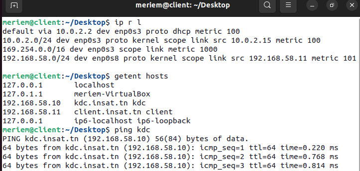

ps: We can check the IP addresses of all three machines by running `hostname -I`. We can check that our machines are reachable using `ping`.

### KDC Configuration
First of all we need to install the following packages on the kdc machine:
 ```
    $ sudo apt-get update
    $ sudo apt-get install krb5-kdc krb5-admin-server krb5-config
 ```
We will be asked to provide the following configuration:

- the realm : 'INSAT.TN' (must be all uppercase)

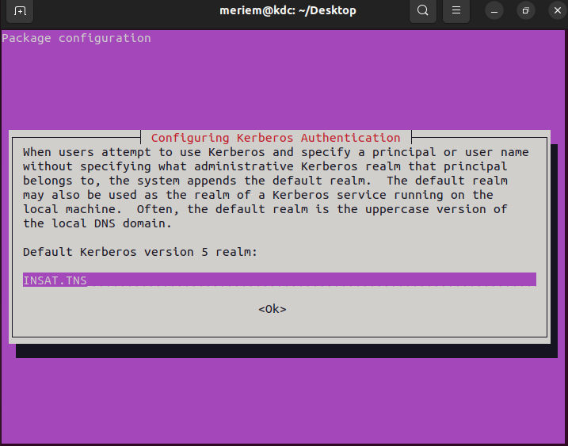

- the Kerberos server : 'kdc.insat.tn'

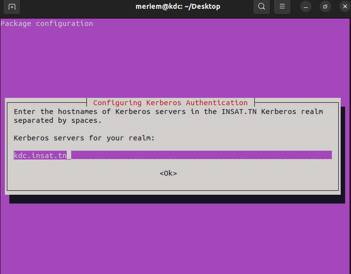

- the administrative server : 'kdc.insat.tn' 

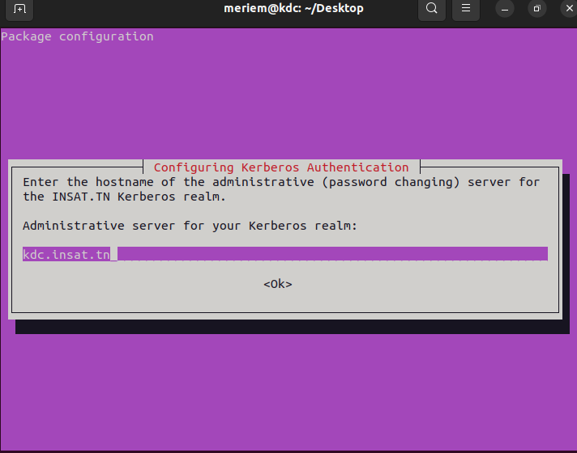

PS: A **Realm** is a logical network, similar to a domain, that defines a group of systems under the same master KDC

Once the installation is complete,we need to set the master key for this KDC database:
```
    $ sudo krb5_newrealm
 ```

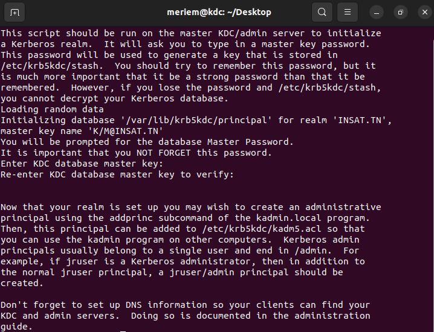

In the context of Kerberos each client or service of the realm is named a **Principal** that should be managed an admin user to do so follow the command bellow :
```
    $ sudo kadmin.local
    kadmin.local:  add_principal root/admin
```

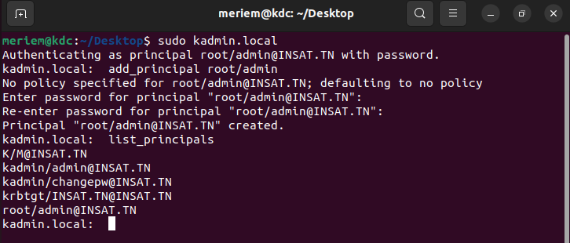

Then, we need to grant all access rights to the Kerberos database to admin principal root/admin using the configuration file **/etc/krb5kdc/kadm5.acl** by adding the following line : `*/admin@INSAT.TN    *`

ps: In order for changes to take effect we need to restart the server by `sudo service krb5-admin-server restart`

Once our server is configured we need to create principals for our client as well as for our service server.
- For the client: 
```
    $ sudo kadmin.local
    kadmin.local:  add_principal meriem
```
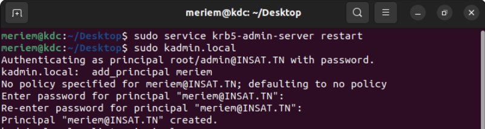
- For the service server
```
    $ sudo kadmin.local
    kadmin.local:  add_principal meriem/mysql.insat.tn
```

- we can check that our principal have been added with list_principals`

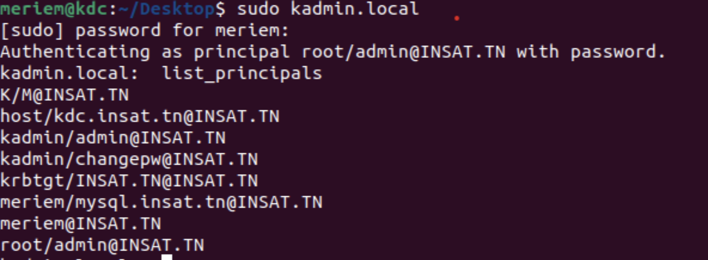
### Service server Machine Configuration

#### Installing + configuring Kerberos
```bash
$ sudo apt-get update
$ sudo apt-get install krb5-user libpam-krb5 libpam-ccreds
```
As edited for the kdc server before :
- the realm : 'INSAT.TN' (must be all uppercase)
- the Kerberos server : 'kdc.insat.tn'
- the administrative server : 'kdc.insat.tn'

#### Preparing the keytab file
We need to extract the service principal from KDC principal database to a keytab file.
```
$ ktutil 
   ktutil:  add_entry -password -p mysql/pg.insat.tn@INSAT.TN -k 1 -e aes256-cts-hmac-sha1-96
   ```

   
Then we need to send the keytab file to the service machine at the directory **/home/mysql/data** :
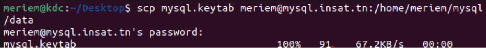
 
 
ps: We need to have openssh-server package installed on the service server : `sudo apt-get install openssh-server`.

We can check that our keytab has been sent succesfully

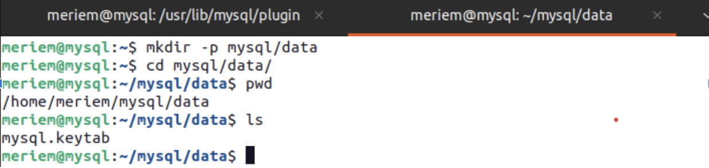


We can also verify that the service principal was succesfully extracted from the KDC database by reading the krb5 keytab into the current keylist by `ktutil:  read_kt home/meriem/mysql/data/mysql.keytab` then listing the current keylist by `ktutil: list`

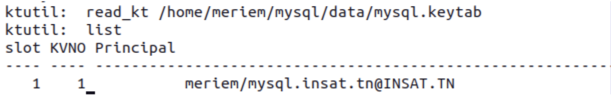

#### Configuring MySQL

Before starting configuring MySQL we need to update packages 
 ```
 sudo apt-get update
  ```
Then we need to install necessary packages for MySQL
 ```
sudo apt-get install mysql-server
  ```
During the installation process, you will be prompted to set a password for the MySQL root user.

To enable kerberos authentication we need to edit **/etc/mysql/my.cnf** file where we add the following to identify the keytab used for **kerberos** authentication


In order for changes to take place we need to run `sudo systemctl restart mysql`

We can check the status of our service by the following :`sudo systemctl status mysql`

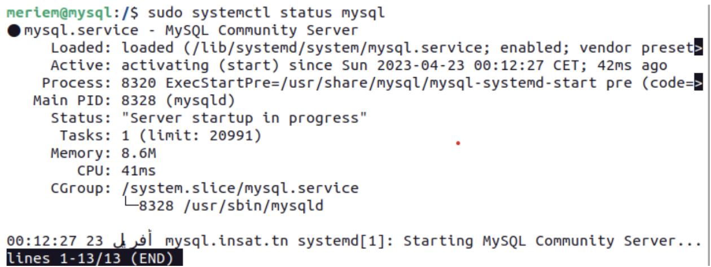


## Contributing

Pull requests are welcome. For major changes, please open an issue first
to discuss what you would like to change.

Please make sure to update tests as appropriate.

## License

[MIT](https://choosealicense.com/licenses/mit/)
